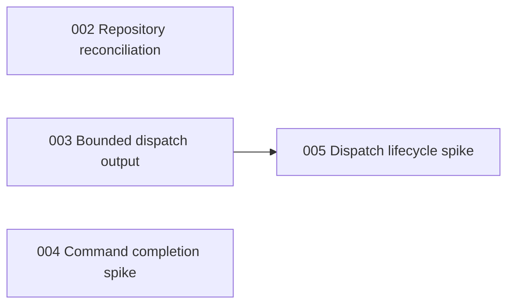

# Implementation Plans

Generated by the improve skill on 2026-08-17 and reconciled on 2026-08-20 at commit `b63f471`. Execute in the order below unless dependencies say otherwise. Each executor must read its plan fully, honor its STOP conditions, and update its row when done unless a reviewer maintains the index.

## Execution order & status

| Plan | Title | Priority | Effort | Depends on | Status |
|------|-------|----------|--------|------------|--------|
| 001 | Copy the selected todo to the system clipboard | P1 | S | — | DONE |
| 002 | Reconcile repository and stored-branch state while refdo is running | P1 | M | — | DONE |
| 003 | Bound subprocess output retained by asynchronous dispatch | P1 | M | — | DONE |
| 004 | Specify a minimal, deterministic colon-command completion design | P2 | S | — | TODO |
| 005 | Prove a safe dispatch cancellation and bounded failure-inspection design | P2 | M | 003 | TODO |

Status values: TODO | IN PROGRESS | DONE | BLOCKED (with one-line reason) | REJECTED (with one-line rationale)

Plans 004 and 005 are design spikes. DONE for those rows means the required implementation-ready design artifact exists and passed the spike gates; it does not mean the user-facing feature has shipped.

## Dependency notes

- Plans 002 and 003 are independent P1 fixes and may execute in parallel.
- Plan 004 is independent and may run alongside either P1 fix, but the confirmed defects should land first when executor capacity is limited.
- Plan 005 requires Plan 003 because cancellation and inspection must preserve its bounded stream-capture contract and use its child spawn/wait seam.
- Plan 005 must end BLOCKED, not invent policy, if the process-group experiment exposes an unapproved descendant boundary or platform difference.
- Plan 001 is complete and has no dependency relationship with the new plans.

## Findings considered and rejected

- Native OS clipboard integration as the default: rejected because it adds platform/display dependencies and does not preserve OSC 52's remote-terminal behavior.
- Listing detached worktrees as branch sections: rejected because branch-organized todos intentionally omit detached worktrees, and repository tests cover that behavior.
- Paste/integration ordering drift: rejected because the local path updates ordering and the persistence refresh self-heals within the same or next event cycle.
- Treating an unchanged SQLite `data_version` after an unknown snapshot as a missed retry: rejected because `UNKNOWN_DATA_VERSION` forces the next refresh attempt even without another commit.
- Adding concurrent-writer stress tests without a stronger concurrency contract: rejected because the proposed test would be timing-sensitive and would not defend a documented behavior.
- Optimizing reorder operations that issue roughly two statements per todo: rejected as low leverage at the expected interactive scale; the operation is user-triggered rather than frame-bound.
- Optimizing per-frame branch-by-todo scans: rejected as low leverage for the expected TUI scale; Unicode wrapping/render work dominates and no profile showed this scan as a bottleneck.
- Adding CI or an `AGENTS.md` solely because neither exists: rejected as generic hygiene rather than an observed operational failure; local fmt, tests, and clippy already have a working baseline.
- Reporting trusted dispatches as a sandbox escape: rejected because unsandboxed Bash execution after explicit config review, trust, and invocation is the documented product model. No separate security defect was confirmed in that boundary.

## Verification baseline

Verified at `b63f471`:

- `cargo fmt --check` — passed.
- `cargo test --all-targets` — passed, 160 tests.
- `cargo clippy --all-targets -- -D warnings` — passed.

`cargo audit` was unavailable, so dependency advisory coverage was not established. The audit did not run real-TTY/OS-matrix checks, external OMP/Worktrunk/Herdr workflows, or measured performance profiling.